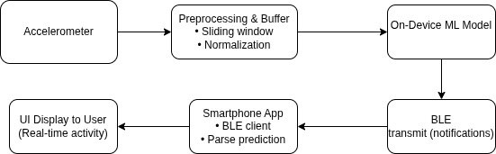
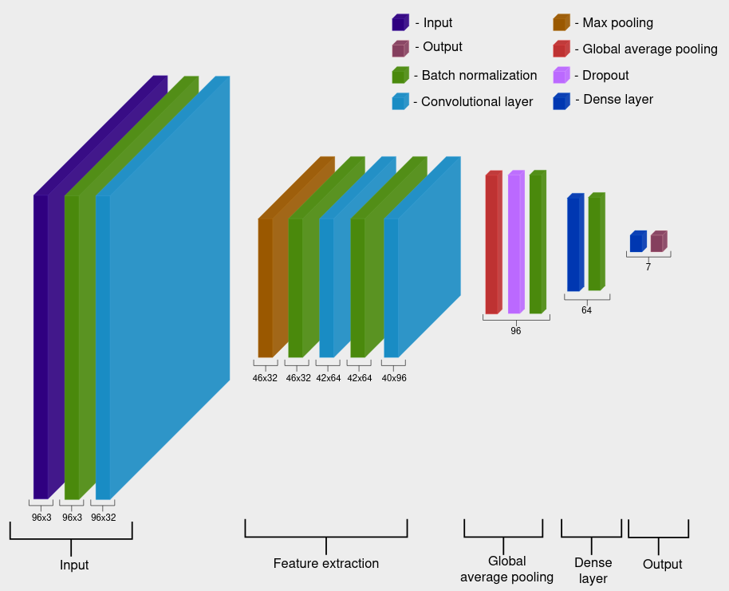
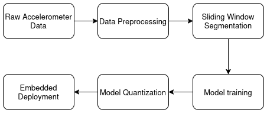
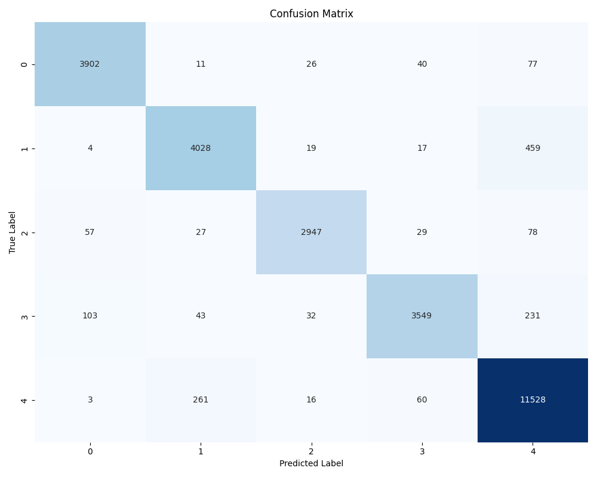

# Human Activity Tracker on the STM32 AI Platform

A wearable activity tracker that recognizes human movements in real-time using a neural network running directly on an STM32 microcontroller. No cloud required - everything happens on-device.

> **For full technical details, see our [IEEE-style paper](paper/paper.tex).**

<p align="center">
  
  <br>
  <em>Fig. 1: Complete system dataflow - from sensor to mobile app</em>
</p>

## What It Does

The tracker recognizes **5 activities** from accelerometer data:
- Rest (sitting, standing, lying)
- Walking
- Running
- Climbing stairs up
- Climbing stairs down

Data is sent via Bluetooth to a Flutter mobile app for visualization and history tracking.

## Hardware

- **Board:** STM32L475 IoT Discovery Kit (B-L475E-IOT01A1)
- **Sensor:** LSM6DSL accelerometer (50 Hz sampling)
- **Battery:** 3.7V 4000mAh Li-Pol (~48 hours of autonomy)
- **Case:** Custom 3D-printed arm mount

## The Model

We trained a 1D Convolutional Neural Network on the [RealWorld dataset](https://www.uni-mannheim.de/dws/research/projects/activity-recognition/dataset/dataset-realworld/) and deployed it using X-CUBE-AI.

<p align="center">
  
  <br>
  <em>Fig. 2: 1D-CNN architecture with Conv1D, pooling, and dense layers</em>
</p>

**Key specs:**
| Metric | Value |
|--------|-------|
| Accuracy | 94.22% |
| RAM usage | 18.33 / 128 KiB |
| Flash usage | 77.19 / 1024 KiB |
| Inference time | 44.22 ms |
| Parameters | 36,525 |

The model uses 8-bit quantization to fit comfortably on the MCU while maintaining accuracy.

<p align="center">
  
  <br>
  <em>Fig. 3: Training pipeline - preprocessing, training, and quantization</em>
</p>

## Results

<p align="center">
  
  <br>
  <em>Fig. 4: Confusion matrix on test set (94.22% accuracy)</em>
</p>

## Project Structure

```
├── firmware/          # STM32CubeIDE project (C code, drivers, AI runtime)
├── firmware/resources/# Python scripts for training and evaluation
├── user_application/  # Flutter mobile app
├── images/            # Diagrams and results
└── paper/             # IEEE-style paper with full details
```

## Authors

- Solomiia Gadiichuk
- Bohdan Zasymovych  
- Marta Kosiv
- Mentor: Yevgeniy Karplyuk

*Ukrainian Catholic University, Lviv*
